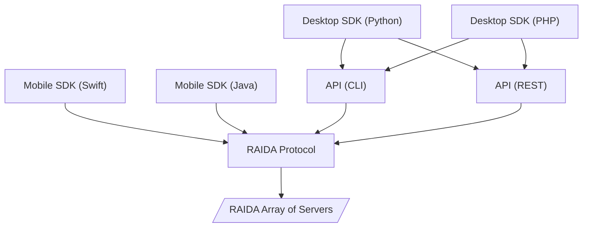

# RaidaTech API Scope of work: Functionalities 
Determine exactly what functionalities will be included in the SDK. This should cover the core capabilities like data shredding, routing, and reassembly for secure token creation and distribution.

## Functionalities to be included:
Except as marked red or yellow, all of these functions have already been implemented using REST API. Many of these have also been implemented using the CLI API. 
🔴 Means not implemented yet. 
🟡 Means not fully implemented yet or needs customization. 
Catagory | Subcat | Function | Description
---|---|---|---
CloudCoin | Status | Echo RAIDA | Sends each RAIDA a ping to check connection. Returns the response time or timeout. 
CloudCoin | Status | Get Task Progress | Returns the progress and outcome of an API call that is asynchonistic. 
CloudCoin | File | Create Location for Wallets | Allows the user to specify where they want wallets to be (like a USB drive)
CloudCoin | File | List Locations for Wallets | Allows the user to see locations that they have choosen to put wallets
CloudCoin | File | Delete Location for Wallets | Allows the user to delete a location that wallets can be
CloudCoin | File | Create Location for Wallets | Allows the user to specify where they want wallets to be (like a USB drive)
CloudCoin | File | Create Wallet | Allows the user to create and name a new wallet
CloudCoin | File | List Wallets | Returns a list of wallets on the compuer
CloudCoin | File | Change Wallet Name | Changes the name of a wallet
CloudCoin | File | Delete Wallet | Deletes the wallet specified
CloudCoin | Wallet | Show Transaction records | Shows past transactions
CloudCoin | Wallet | Delete Transaction records | Deletes the transaction files for privancy sake
CloudCoin | Wallet | Count Coins | Shows how many coins are in a wallet
CloudCoin | Coins | Take Ownership | Changes the passwords on CloudCoin files
CloudCoin | Coins | Withdraw To PNG  | Removes coins from the wallet into a PNG file
CloudCoin | Coins | Withdraw To PNG Many Times  | Removes coins from the wallet into a PNG file more than once
CloudCoin | Coins | Withdraw To .bin  | Removes coins from the wallet into a .bin file
CloudCoin | Coins | Withdraw To .bin Many Times  | Removes coins from the wallet into a .bin file multiple times
CloudCoin | Locker | Peek into Locker | Shows how many coins are in a locker
CloudCoin | Locker | Create Locker and Move Coins Into It |  Creates a new coin locker on the RAIDA
CloudCoin | Locker | Create Many Locker and Move Coins Into Them |  Creates many lockers and puts coins in them
CloudCoin | Locker | Remove Locker Contents | Moves the coins in a RAIDA locker to the local computer
CloudCoin | Health | Check Health | Runs a detect against the RAIDA to see if the coins are authentic
CloudCoin | Health | Backup Coins | Makes a copy of the user's coins
CloudCoin | Health | Fix Coins | Syncronizes coins so that they are authentic on all RAIDA
Swap | Market | Sell Coins | Puts coins on the RAIDA to sell at a price specified
Swap | Market | List Coins For Sale | Lists all the coins for sale and at what price
Swap | Market | 🟡 Buy Coins | ≈Buys the coins and downloads them to the wallet
Swap | Market | List Past Swaps | Shows a URL of a database of past swaps. 
Token | Accounts | Create Account and Put in Group. Group can be either kyc, kycadmin, user, treasurer, raida or admin.
Token | Accounts | Delete Account | Removes an account
Token | Accounts | 🔴 Freeze Account | Removes an account
Token | Accounts | 🔴 Unfreeze Account | Removes an account
Token | Accounts | 🔴 Grant Permissions | Gives the user permssions. 
Token | Treasury | Audit | Shows all of the events that have happened in the period specified
Token | Treasury |  [Create Tokens](#create-tokens) | Orders that tokens be created
Token | Treasury |  [Delete Tokens](#delete-tokens) | Orders tokens to be destroyed. 
Token | Treasury |  [Freeze Tokens](#freeze-tokens) | Stops coins specified from being transacted until unfrozen.  
Token | Treasury | [Unfreeze Tokens](#unfreeze-tokens) | Returns the control of the coins to the user.  
Token | Treasury |  [Seize Tokens](#seize-tokens) | Orders tokens to be put into a locker for the treasurer. 
Token | Treasury |  [Get All SNs](#get-all-sns)|  Returns all the serial numbers that the RAIDA has minted.
Token | Treasury | 🟡  [Create_Depository](create-depository) | Creates a Depository for an exchange, merchant of bank
Token | Treasury | 🟡  [Stop_Depository](stop) | Stop a depository from accepting or releasing coins
Token | Treasury | [🟡  Set Fee For Swaps](#set-fee-for-swaps) | The conversion fee set in percentages. 
Banking | Bank |  [Show Statement](#show-statement) | Shows the owner of the Depository all the history of transactions. 
Banking | Bank |  🟡 Balance | Shows Bank Balance
Banking | Bank |  🟡 Deposit Locker Code | Puts coins into an account by locker code
Banking | Bank |  🟡 Deposit File | Puts coins into an account from a file
Banking | Bank |  🟡 Withdraw to Locker code | Withdraws coins to a locker code
Banking | Bank |  🟡 Withdraw to File | Withdraws coins to a PNG or BIN
Banking | Bank |  🟡 Send | Moves coins to a new user without an invoice
Banking | Merchant | 🔴 Create QR | Creates a QR code so that a merchant can show a phone use how to pay  
Banking | Merchant | 🔴 Pay House | People put money into a special depository & receive an invoice. 
Banking | Merchant | 🔴 Read Public Reciept | This receipt id allows anyone to see that payment was made. 
Banking | Merchant | 🔴 Confirm Payment | Confirms that a payment has been made based on transaction number.
Key | Unknow User| 🔴 Exchange | Gets a quantum safe key that is a shared secret between the user and the computer specified. 
Storage | File | [Create Folder](#create-folder) | Creates a folder on the RAIDA
Storage | File | [Show Folder Contents](#show-folder-contents) | Lists the files and folders
Storage | File | [Remove Folder](#remove-folder) | Removes a folder from the RAIDA
Storage | File | [Put Object](#put-object) | Uploads a file or binary data
Storage | File | [Get Object](#get-object) | Downloads a file or binary data
Storage | File | [Remove Object](#remove-object) | Deletes a file or binary data
Storage | File | 🟡 Upload Private Key | Loads a Private Key of crypto wallet that has not been seen by anyone
Storage | File | 🟡 Read Private Key | Loads a Private Key of crypto wallet that has not been seen by anyone
Storage | Share | 🔴 Create Share | Creates a folder that can be read from by others such as "Shared Directory"
Storage | Share | 🔴 Delete Share | Deletes a shared foler
Storage | Share | 🔴 Unhide share | Allows the share to be see in Active Directory
Storage | Share | 🔴 Set Permissions | Allows users or groups to access the folder. All denied by default
Ghost Chat | Chat | 🟡 Send | Uploads a file to another user's inbox including attachments.
Ghost Chat | Chat | 🟡 Receive | Downloads a file from the user's inbox including attachments.
Ghost Chat | Chat | 🔴 Spam | Allows the user to send a message to the public inbox. 
Ghost Chat | Chat | 🔴 Receive Spam | Allows the user to download files in the public inbox. 
GPT Anonymous | Chat | 🟡 Request | User sends AI a prompt.

<!--

CloudCurrency | [CloudCurrency](#cloudcurrencies) | Same technology as CloudCoin version 3
Digital Certificates | Allows for managed currencies such as stable tokens
Digital Certificates | Can also be used for Asset Tokenization)
Private Digital Collectibles| Allow media to be accessed only by owners of that media (Cerebrum but private)
Digital Lockers | Lockers for holding CloudCurrencies and Digital Cerficiates
Digital Banking | Services for currencies and cerficiates such as lockboxes, authentication, storage, sending
Digital Exchange | Services for swapping currencies and assets including blockchains
Digital Exchange Private Collectibles | Exchange for selling collectibles
Digital Merchant & Payment Systems | Allows merchants to accept currecies as payment
Secure Data Storage | Storing any datafiles
Secure Messaging | Storing and addressing messages
Quantum Safe Key Exchange | Exchanging keys between machines that do not share a common secret
Crypto Wallet Sub-custodial Service | Allows banks, exchanges and regulare folks to store crypto keys until needed
Open Hosting | Allows anyone to have a RAIDA node. No more set limit of 25.  
Coin Registry Blockchain | Allows CloudCurrencies and Certificates to use open hosting

# 1. There are three
-->
# How APIs may be structured. 

<!--
Breakdown:
Desktop SDKs: Connect via their respective APIs.
Mobile SDKs: Directly connect using the RAIDA protocol, without APIs.
RAIDA Protocol: Acts as the bridge to connect both API and SDK layers to the "RAIDA Array of Servers".
Connections: Use arrows to represent the flow between these elements.
Further Suggestions:
You may consider color-coding each category (such as APIs, SDKs, Protocols) for better visual distinction.
Labels or additional notes can describe each element's role or technological detail (e.g., "Desktop SDKs" using specific programming languages).
This diagram sets a clear pathway illustrating how different components in your network architecture interact. Let me know if there are any additional details or adjustments you'd like to make!

The Scope of work shall we decided into three different categories:

CloudCoin Whitelable

Hosted By RaidaTech:
———————————

## DESKTOP APIs FOR RAIDAs HOSTED BY RAIDATECH
API | Description
---|---
[CloudCurrency](#cloudcurrencies) | Same technology as CloudCoin version 3
Digital Certificates | Allows for managed currencies such as stable tokens
Digital Certificates | Can also be used for Asset Tokenization)
Private Digital Collectibles| Allow media to be accessed only by owners of that media (Cerebrum but private)
Digital Lockers | Lockers for holding CloudCurrencies and Digital Cerficiates
Digital Banking | Services for currencies and cerficiates such as lockboxes, authentication, storage, sending
Digital Exchange | Services for swapping currencies and assets including blockchains
Digital Exchange Private Collectibles | Exchange for selling collectibles
Digital Merchant & Payment Systems | Allows merchants to accept currecies as payment
Secure Data Storage | Storing any datafiles
Secure Messaging | Storing and addressing messages
Quantum Safe Key Exchange | Exchanging keys between machines that do not share a common secret
Crypto Wallet Sub-custodial Service | Allows banks, exchanges and regulare folks to store crypto keys until needed
Open Hosting | Allows anyone to have a RAIDA node. No more set limit of 25.  
Coin Registry Blockchain | Allows CloudCurrencies and Certificates to use open hosting

## CloudCurrencies
Name | Functionality | Phase | CLI | REST | Mobile | Notes
Authentication | Authenticates Coins | 1 | 🟢 | 🟢 | 🔴 | Implemented
Syncronization | Fixes Fracked Coins | 1 | 🟢 | 🟢 | 🔴 | Implemented
Authentication | Authenticates Coins | 1 | 🟢 | 🟢 | 🔴 | Implemented

Self-Hosted by Customer
———————————-
To do self hosted by customer:
Depends on: 
1. Coin Registry Blockchain 
2. Open hosting (allows for more than 25 RAIDA)
3. Exchanges may need some extra tech too. 

CloudCurrency
Digital Certificates (Stable Tokens)
Digital Certificates (Asset Tokenization)
Private Digital Collectibles  (Cerebrum but private)
Digital Lockers Free
Digital Banking
Digital Exchange
Digital Exchange Private Collectibles 
Digital Merchant & Payment Systems
Secure Data Storage
Secure Messaging
Quantum Safe Key Exchange

Digital Currencies (Wild) On CloudCoin Servers:
Wild means the coins start with a fixed amount, users do not need to be approved to use the coins and there are not tracking of user activity. 
Coin Creation
RAIDA Initialization (naming and numbering coins)
Minting Coins 
Authenticating Coins
Synchronizing Coins
Desktop Customization
Web App Customization
SMS App Customization
Android App Customization
iPhone App Customization

	-Minting
	-Authentication
	-Syncrhonization

Digital Currencies on user’s Servers
Sam 

Registering DNS 

-->

