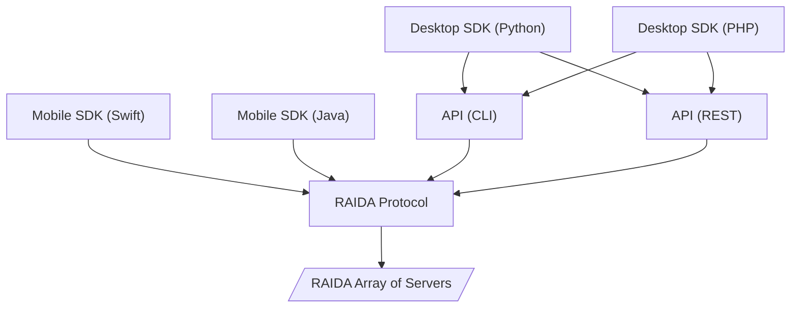

# Scopeofwork
Scope of work for the API SDK project

# 1. There are three

Breakdown:
Desktop SDKs: Connect via their respective APIs.
Mobile SDKs: Directly connect using the RAIDA protocol, without APIs.
RAIDA Protocol: Acts as the bridge to connect both API and SDK layers to the "RAIDA Array of Servers".
Connections: Use arrows to represent the flow between these elements.
Further Suggestions:
You may consider color-coding each category (such as APIs, SDKs, Protocols) for better visual distinction.
Labels or additional notes can describe each element's role or technological detail (e.g., "Desktop SDKs" using specific programming languages).
This diagram sets a clear pathway illustrating how different components in your network architecture interact. Let me know if there are any additional details or adjustments you'd like to make!

# 2. Identify key tasks and milestones

## Define the Scope of the SDK

Determine exactly what functionalities will be included in the SDK. This should cover the core capabilities like data shredding, routing, and reassembly for secure token creation and distribution.

The Scope of work shall we decided into three different categories:

CloudCoin Whitelable

Hosted By RaidaTech:
———————————

## DESKTOP APIs FOR RAIDAs HOSTED BY RAIDATECH
API | Description
---|---
[CloudCurrency](#cloudcurrencies) | Same technology as CloudCoin version 3
Digital Certificates | Allows for managed currencies such as stable tokens
Digital Certificates | Can also be used for Asset Tokenization)
Private Digital Collectibles| Allow media to be accessed only by owners of that media (Cerebrum but private)
Digital Lockers | Lockers for holding CloudCurrencies and Digital Cerficiates
Digital Banking | Services for currencies and cerficiates such as lockboxes, authentication, storage, sending
Digital Exchange | Services for swapping currencies and assets including blockchains
Digital Exchange Private Collectibles | Exchange for selling collectibles
Digital Merchant & Payment Systems | Allows merchants to accept currecies as payment
Secure Data Storage | Storing any datafiles
Secure Messaging | Storing and addressing messages
Quantum Safe Key Exchange | Exchanging keys between machines that do not share a common secret
Crypto Wallet Sub-custodial Service | Allows banks, exchanges and regulare folks to store crypto keys until needed
Open Hosting | Allows anyone to have a RAIDA node. No more set limit of 25.  
Coin Registry Blockchain | Allows CloudCurrencies and Certificates to use open hosting

## CloudCurrencies
Name | Functionality | Phase | CLI | REST | Mobile | Notes
Authentication | Authenticates Coins | 1 | 🟢 | 🟢 | 🔴 | Implemented
Syncronization | Fixes Fracked Coins | 1 | 🟢 | 🟢 | 🔴 | Implemented
Authentication | Authenticates Coins | 1 | 🟢 | 🟢 | 🔴 | Implemented

Self-Hosted by Customer
———————————-
To do self hosted by customer:
Depends on: 
1. Coin Registry Blockchain 
2. Open hosting (allows for more than 25 RAIDA)
3. Exchanges may need some extra tech too. 

CloudCurrency
Digital Certificates (Stable Tokens)
Digital Certificates (Asset Tokenization)
Private Digital Collectibles  (Cerebrum but private)
Digital Lockers Free
Digital Banking
Digital Exchange
Digital Exchange Private Collectibles 
Digital Merchant & Payment Systems
Secure Data Storage
Secure Messaging
Quantum Safe Key Exchange

Digital Currencies (Wild) On CloudCoin Servers:
Wild means the coins start with a fixed amount, users do not need to be approved to use the coins and there are not tracking of user activity. 
Coin Creation
RAIDA Initialization (naming and numbering coins)
Minting Coins 
Authenticating Coins
Synchronizing Coins
Desktop Customization
Web App Customization
SMS App Customization
Android App Customization
iPhone App Customization

	-Minting
	-Authentication
	-Syncrhonization

Digital Currencies on user’s Servers
Sam 

Registering DNS 

