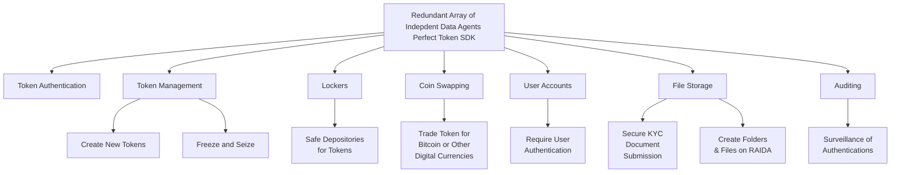

```mermaid
graph TD
    A[Redundant Array of Indepdent Data Agents <br>Perfect Token SDK] --> B[Token Authentication]
    A --> C[Token Management]
    A --> D[Lockers]
    A --> E[Coin Swapping]
    A --> F[User Accounts]
    A --> G[File Storage]
    A --> I[Auditing]
    
    C --> C1[Create New Tokens]
    C --> C2[Freeze and Seize]
    
    D --> D1[Safe Depositories<br>for Tokens]
    
    E --> E1[Trade Token for<br>Bitcoin or Other<br>Digital Currencies]
    
    F --> F1[Require User<br>Authentication]
    
    G --> G1[Secure KYC<br>Document <br>Submission]
    G --> G2[Create Folders <br>& Files on RAIDA]
    
    I --> I1[Surveillance of<br>Authentications]
    
```
