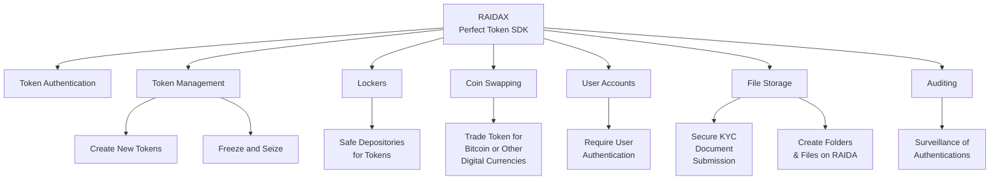

# Liberty Through “Perfect” Tokenization
## Your Path to Property
### Free from The Perfect Money Foundation, Supported by RaidaTech Inc.

RAIDAX is a revolutionary network architecture that makes the blockchain obsolete by creating a distributed array of 
servers that solve the biggest problems of digital currencies and tokenization. 
The ‘X’ in RAIDAX means that the RAIDA can run any type of digital asset such as coins, stable tokens, referenced tokens, 
  stocks, bonds and NFTs. This supports any monetary system, payment system or exchange system. 

Tokens created using RAIDAX: 
* The only true digital cash that does not use a centralized database ( such as public ledgers) to track token ownership.
* Optionally 100% private and require no user accounts, passwords or records of transactions.  
* The most energy efficient tokens requiring no fees, expensive servers or notable electricity. 
* Easily exchangeable with no on-ramps or off-ramps acting as choke points and surveillance points. 
* Optionally configured to require KYC, Accounts, Freeze and Seize and accountability.
* Handle more transactions in less time than any other token technology. 
* Quantum safe requiring no public or private keys. 
* No systemic risk of failure of loss and theft of tokens. Tokens can even be recovered if lost.
* The only cross-over tokens that can go from the real world into virtual reality, video games and any other software. 

The Pefect Money Foundation provides a version for free and RaidaTech provides advanced versions and customization.

## Components Available in the RAIDAX Perfect Token SDK (Software Development Kit)  

# Component Details
## Token Authentication
Allows people to check the authentication of tokens and change the authenticity numbers so they can take ownership. 
Users connect to the RAIDA using quantum safe AES encryption and the UDP transport protocol. This removes any need for 
slow "handshakes" allowing transaction to be confirmed completed in less than a half a second. Because the process
only requires a update, servers the size of a Raspberry Pi can perform millions of transactions per second using next to no electricty, 
bandwidth, or expensive servers, thus out-performing all other payment systems in the world. 

Privacy options include 100% privacy mode, 100% suvailance mode or custom mode. 

100% privacy mode requires no user accounts and does record any user actions. 

100% suvailance mode may require users to pass a KYC process to obtain an account whose actions can be tracked. 

Privacy can be customized by Raidatech to meet any privacy and survailance requirements. 

## Token Management (Create new tokens. Freeze and Seize)
RAIDAX allows for a “Treasurer” to mint new coins and freeze and seize those that have been created. 
RAIDAX includes a special “Treasurer’s workstation" that contains the software needed to manage all the tokens in the system.

The Treasurer’s Workstation is a virtual machine that can run within another computer or placed directly on a dedicated machine. 
If Token creators would like to have a fixed number of tokens that never increase (no monetary inflation), this mint capability 
can disabled by commissioning RaidaTech to make this customization.  

## Lockers (Safe Depositories for Tokens)
Users can place their coins in a “Locker” on the RAIDA and obtain a key for that locker. These lockers make it convient
for one user to send tokens to another by using a simple one-time locker key that can be transfered from person to person.

## Coin Swapping (Trade your token for Bitcoin or other digital currencies)
RAIDAX supports the RAIDA owning Bitcoin wallets and can be customized for other digital currencies and tokens. 
A Bitcoin wallet is actually a file that contains public and private keys. 
This wallet file is striped-with-parity on the 25 RAIDA resulting in sixteen RAIDA needing to approve sending Bitcoin.

The coin swap feature allows the RAIDAX to be configured to charge a fee for swaps earning the RAIDA money.

Currently, RAIDAX supports the swapping of one token (Bitcoin), but users can commission RaidaTech to add swap for tokens they would like to include.

## Account Management (Option to require users to authenticate coins) 
RAIDAX allows a RAIDA Administrator to require that users to have an account on the RAIDA before they can authenticate tokens. 
This also allows the Admins to use the KYC functionality to process new potential users.
User accounts allow the activities of users to be surveilled. Users accounts can be locked by the Administrator. 
These accounts also allow for permissions to be customized such as how many tokens a user can use in one day, 
and file sharing possibilities that can be customized by commissioning RaidaTech to make additions. 

## File Submission KYC ( Option to allow users to submit KYC documents securely)
RAIDAX allows new users to connect to the RAIDA and upload KYC documents. 
These documents are stored in a hackproof manner on the RAIDA for the most secure KYC document storage in the world. 
These KYC documents can be accessed by special KYC accounts created by the Treasurer. 

## File Storage ( Users can create folders on the RAIDA and store files) 
RAIDAX allows users to store data on the RAIDA. They are able to create folders and upload and download files
in a supersecure, quantum safe manner. 

## Auditing ( Optional surveillance of authentications, performance and number of tokens)
The Treasurer's workstation includes software that allows administrators to us AI to learn information that would be helpful
for marketing decisions, performance issues and crime detection. 

# User Software
RAIDAX comes with opensource desktop, server and web software to make it easy to customize your user's experience. 

Software includes: 
* Desktop software for Windows, Linux and Mac
* Web based software that can be used by any device including mobile devices.
* SMS software to manage Tokens using cell phones without users needing to install softwared.
* Perfect Core. Server and client CLI/REST API service that allows any program to quickly connect to the RAIDAX.

Software is always evolving and customizations can be done within your organization or contracted via RaidaTech. 
