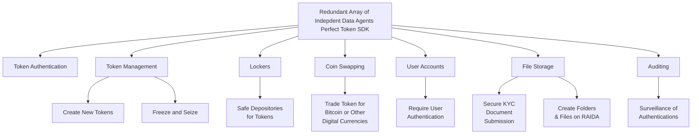

# Liberty Through “Perfect” Tokenization
## Your Path to Property
### Free from The Perfect Money Foundation

RAIDAX is a revolutionary network architecture that makes the blockchain obsolete by creating a distributed array of 
servers that solve the biggest problems of digital currencies and tokenization. 
The ‘X’ in RAIDAX means that the RAIDA can run any type of digital asset such as coins, stable tokens, referenced tokens, 
  stocks, bonds and NFTs. This supports any monetary system, payment system or exchange system. 

Tokens created using RAIDAX: 
* The only true digital cash that does not use a centralized database ( such as public ledgers) to track token ownership.
* Optionally 100% private and require no user accounts, passwords or records of transactions.  
* The most energy efficient tokens requiring no fees, expensive servers or notable electricity. 
* Easily exchangeable with no on-ramps or off-ramps acting as choke points and surveillance points. 
* Optionally configured to require KYC, Accounts, Freeze and Seize and accountability.
* Handle more transactions in less time than any other token technology. 
* Quantum safe requiring no public or private keys. 
* No systemic risk of failure of loss and theft of tokens. Tokens can even be recovered if lost.
* The only cross-over tokens that can go from the real world into virtual reality, video games and any other software. 

The Pefect Money Foundation provides a version for free and RaidaTech provides advanced versions and customization.

## Functionality Available in the Free Version  

