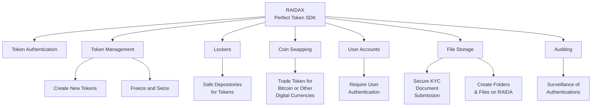

# RAIDAX: Redefining Digital Assets Beyond Blockchain
RAIDAX introduces a groundbreaking network architecture that transcends the limitations of blockchain by leveraging a distributed array of servers known as RAIDA (Redundant Array of Independent Detection Agents). This innovative system addresses the most pressing challenges in digital currencies and tokenization. The ‘X’ in RAIDAX signifies its versatility, enabling the RAIDA network to support any digital asset—ranging from coins and stable tokens to stocks, bonds, NFTs, and beyond—seamlessly integrating with any monetary, payment, or exchange system.

### Tokens Powered by RAIDAX Offer Unmatched Advantages:  
* True Digital Cash: Operates without centralized databases or public ledgers, ensuring decentralized ownership tracking.  
* Privacy by Design: Optionally 100% private, requiring no user accounts, passwords, or transaction records.  
* Unrivaled Efficiency: The most energy-efficient tokens, eliminating fees, costly servers, and significant power consumption.  
* Frictionless Exchange: Easily tradable with no on-ramps, off-ramps, or surveillance choke points.  
Flexible Compliance: Configurable for KYC, account management, freeze/seize capabilities, and accountability when required.  
* Superior Scalability: Processes more transactions faster than any competing token technology.  
* Quantum Resilience: Security without reliance on public/private keys, making it quantum-safe.  
* Robust and Secure: Eliminates systemic risks of loss or theft, with recoverable tokens even if misplaced.  
* Cross-Reality Utility: The only tokens bridging physical and digital realms, from real-world use to virtual reality, gaming, and software ecosystems.

The Perfect Money Foundation offers a free version of RAIDAX-powered tokens, while RaidaTech provides advanced, customizable solutions for enterprise needs.

## Components Available in the RAIDAX Perfect Token SDK (Software Development Kit)  

# Component Details
## Token Authentication
RAIDAX enables users to verify token authenticity and update ownership by altering authenticity numbers. Authentication occurs via a quantum-safe AES-encrypted connection to the RAIDA network, utilizing the UDP transport protocol. By eliminating slow handshake processes, transactions are confirmed in under half a second. This lightweight process requires only minimal updates, allowing servers as small as a Raspberry Pi to handle millions of transactions per second. With negligible electricity, bandwidth, and hardware costs, RAIDAX outperforms all existing payment systems globally.

Privacy Options:  
* 100% Privacy Mode: No user accounts or action logs are required, ensuring complete anonymity.  
* 100% Surveillance Mode: Enforces KYC compliance and tracks user actions via registered accounts.  
* Custom Mode: Tailored privacy and surveillance settings, configurable by RaidaTech to meet specific needs.

## Token Management (Minting, Freezing, and Seizing)
RAIDAX empowers a designated “Treasurer” to mint new tokens and freeze or seize existing ones. This functionality is managed through the Treasurer’s Workstation—a virtual machine deployable on a host computer or standalone hardware. For systems requiring a fixed token supply (e.g., to prevent inflation), the minting feature can be permanently disabled through a custom configuration by RaidaTech.

## Lockers (Secure Token Depositories)
Users can store tokens in RAIDA “Lockers,” each secured with a unique key. This feature simplifies peer-to-peer transfers by allowing users to share one-time locker keys, enhancing convenience and security without requiring direct account interaction.

## Coin Swapping (Exchanging Tokens for Bitcoin and Beyond)
RAIDAX supports integration with Bitcoin wallets and can be extended to other digital currencies through customization. Bitcoin wallet files, containing public and private keys, are distributed across the 25 RAIDA nodes using a striped-with-parity approach, requiring approval from 16 nodes to execute a transfer. This ensures robust security. The swap feature can be configured to charge fees, generating revenue for the RAIDA network. While Bitcoin swapping is currently supported, RaidaTech can expand compatibility to additional tokens upon request.

## Account Management (Optional User Authentication)
RAIDAX allows administrators to mandate user accounts for token authentication, enabling KYC enforcement and activity monitoring. Admins can lock accounts, set usage limits (e.g., daily transaction caps), and customize permissions, such as file-sharing capabilities, with RaidaTech’s support. This flexibility balances compliance and user control.

## File Submission KYC (Secure Document Uploads)
New users can submit KYC documents directly to the RAIDA network, where they are stored in a tamper-proof, quantum-safe environment—the most secure KYC storage solution available. Access to these documents is restricted to special KYC accounts managed by the Treasurer, ensuring compliance and confidentiality.

## File Storage (User-Controlled Data Repositories)
RAIDAX enables users to create folders and store files on the RAIDA network. Data is uploaded and downloaded in a super-secure, quantum-safe format, offering unparalleled protection and accessibility for personal or organizational use.

## Auditing (Monitoring and Insights)
The Treasurer’s Workstation includes auditing tools powered by AI, providing administrators with actionable insights. These tools analyze token authentications, system performance, and transaction volumes to support marketing strategies, optimize operations, and detect potential misuse.

# User Software
RAIDAX comes with opensource desktop, server and web software to make it easy to customize your user's experience. 

Software includes: 
* Desktop software for Windows, Linux and Mac
* Web based software that can be used by any device including mobile devices.
* SMS software to manage Tokens using cell phones without users needing to install softwared.
* Perfect Core. Server and client CLI/REST API service that allows any program to quickly connect to the RAIDAX.

Software is always evolving and customizations can be done within your organization or contracted via RaidaTech. 
